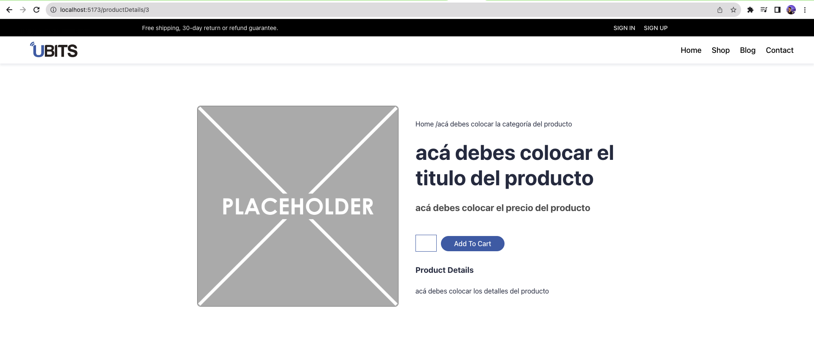

# 🤓 Reto UBITS

## Setup Backend: configuración del servidor

## Backend Parte 1

recuerda que este reto requiere que completes el reto de backend dado que este servirá como la API de nuestro e-commerce para esto primero crea una lista de al menos 5 productos los cuales tengan las siguientes propiedades:

```js
{
   title: TEXT,
   price: INT,
   category: TEXT,
   description: TEXT,
   image: TEXT,
   stock: INT
}
```

para esto puedes usar [postman](https:learning.postman.com/docs/getting-started/overview/), donde realices peticiones POST para agregar productos a nuestro e-commerce

```js
POST 127.0.0.1:8080/products;
```

de tal manera que cuando en nuestra API solicitemos los productos creados podamos ver una lista de todos los productos:

```js
GET 127.0.0.1:8080/products;
```

este setting inicial es fundamental para iniciar correctamente el desarrollo de nuestro reto en React.

estas son algunas url que te podrán servir para el setting de las imágenes de tus productos:

```js
[
  "https:fakestoreapi.com/img/81fPKd-2AYL._AC_SL1500_.jpg",
  "https:fakestoreapi.com/img/71-3HjGNDUL._AC_SY879._SX._UX._SY._UY_.jpg",
  "https:fakestoreapi.com/img/71li-ujtlUL._AC_UX679_.jpg",
  "https:fakestoreapi.com/img/71YXzeOuslL._AC_UY879_.jpg",
  "https:fakestoreapi.com/img/71pWzhdJNwL._AC_UL640_QL65_ML3_.jpg",
  "https:fakestoreapi.com/img/61sbMiUnoGL._AC_UL640_QL65_ML3_.jpg",
  "https:fakestoreapi.com/img/71YAIFU48IL._AC_UL640_QL65_ML3_.jpg",
  "https:fakestoreapi.com/img/51UDEzMJVpL._AC_UL640_QL65_ML3_.jpg",
  "https:fakestoreapi.com/img/61IBBVJvSDL._AC_SY879_.jpg",
  "https:fakestoreapi.com/img/61U7T1koQqL._AC_SX679_.jpg",
  "https:fakestoreapi.com/img/71kWymZ+c+L._AC_SX679_.jpg",
  "https:fakestoreapi.com/img/61mtL65D4cL._AC_SX679_.jpg",
  "https:fakestoreapi.com/img/81QpkIctqPL._AC_SX679_.jpg",
  "https:fakestoreapi.com/img/81Zt42ioCgL._AC_SX679_.jpg",
  "https:fakestoreapi.com/img/51Y5NI-I5jL._AC_UX679_.jpg",
  "https:fakestoreapi.com/img/81XH0e8fefL._AC_UY879_.jpg",
  "https:fakestoreapi.com/img/71HblAHs5xL._AC_UY879_-2.jpg",
  "https:fakestoreapi.com/img/71z3kpMAYsL._AC_UY879_.jpg",
  "https:fakestoreapi.com/img/51eg55uWmdL._AC_UX679_.jpg",
  "https:fakestoreapi.com/img/61pHAEJ4NML._AC_UX679_.jpg",
];
```

### Nota:

Para realizar el reto y consumir información de la API que creaste recuerda tener prendido el servidor backend y asegurarte con postman que se esta ejecutando correctamente las peticiones en nuestra API.

## Backend Parte 2

Ademas de esto es necesario que nuestro backend permita recibir peticiones a servidores fuera de nuestro dominio a esto se le conoce como la política CORS de datos e información, esta acción no esta permitida por defecto en express de tal manera que debemos habilitar dicha opción para esto debemos ir a nuestra carpeta del reto backend correr el siguiente comando:

```bash
npm install cors
```

y luego en nuestro index.js colocar las siguientes lineas de código:

```js
var express = require("express");
var cors = require("cors");
var app = express();

app.use(cors());
```

puedes encontrar mas información sobre las políticas CORS y como permitir peticiones para servidores externos en el siguiente [link](https:expressjs.com/en/resources/middleware/cors.html).

## Reto React - Frontend

## Parte 1.

en el componente (pagina) `Home` usa el hook useEfFect para hacer el llamado de la data, esto unicamente en el montado del componente que se utilizara en la sección de sellers, recuerda llamar de tu API, en la url **http:127.0.0.1:8080/product** tu API debe estar encendida y corriendo localmente ademas de tener algunos productos iniciales para renderizar para almacenar la información llamada en nuestra API usa el hook useState para almacenar en un estado los productos obtenidos y pasarlos al componente `Sellers`

```js
GET 127.0.0.1:8080/products;
```

## Parte 2.

en el componente `Sellers` crear el typo en typescript con la información que se recibirá y renderizara en este componente recuerda que este sera un arreglo de productos donde los productos tienen la estructura que se presento anteriormente, este typo utilízalo para definir el type de los parámetros de entrada de este componente, ten en cuenta que este sera un arreglo de objetos.

```js
[
  {
    title: TEXT,
    price: INT,
    category: TEXT,
    description: TEXT,
    image: TEXT,
    stock: INT,
  },
];
```

## Parte 3.

luego de obtener los productos de nuestro backend y pasarlos al componente `Sellers`, utiliza el método **map** para iterar sobre cada producto y mostrar una tarjeta por cada uno de los productos para esto utiliza el componente `Card` que encuentras en la carpeta de `components`.

## Parte 4.

en el componente `Card` crear el **type** en typescript con la información que se recibirá y renderizara en este componente recuerda que este serán los parámetros de un producto que tiene la estructura que se presento anteriormente, este typo utilízalo para definir los parámetros de entrada de este componente.

## Parte 5.

dado el css en `Card.css` deduce la estructura del `TSX` de este componente para que se vea igual a como se presenta en el gif donde debe tener las mismas animaciones on hover del elemento.

<p align="center">
  
</p>

## Parte 6.

Ahora en el archivo **App.tsx** utiliza el método `createBrowserRouter`, para crear la ruta de `Home` el cual sera el componente `Home.tsx` que encuentras en la carpeta **pages**, ademas de esto agrega una ruta dinámica `productDetail/:id` la cual mostrara los detalles del producto seleccionado utilizando el componente `ProductDetails`.

luego en el componente App retorna el `RouterProvider` que contendrá el router creado con `createBrowserRouter`

## Parte 7.

Luego en el componente **Card** utiliza el componente `Link` expuesto por **react-router-dom** para dirigir al usuario a la ruta `/productDetails/:id` cuando el usuario de click en el botón de `Buy Now`

## Parte 8.

en el componente (pagina) `ProductDetails` usa el hook useEfFect para hacer el llamado del producto seleccionado, unicamente en el montado del componente, para esto utiliza el hook `useParams` obtén el **id** de la ruta y utilízalo para llamar unicamente los detalles del producto seleccionado.

```js
 GET 127.0.0.1:8080/product/:id;
```

luego utiliza el hook useState para guardar la información obtenida del producto y pásala como props al componente **Details**.

NOTA: debes crear un type para definir los parámetros que vas a recibir del hook `useParams`.

## Parte 9.

dada la siguiente estructura de JSX en el componente `Details` agrega los estilos css necesarios para ver los detalles del producto, donde se vea como se presenta en la siguiente imagen

<p align="center">
  
</p>

## Parte 10.

crear el typo en typescript con la información que se recibirá y renderizara en este componente recuerda que este serán los parámetros de un producto que tiene la estructura que se presento anteriormente, este typo creado utilízalo para definir el type de los parámetros de entrada de este componente.

## Parte 11.

por ultimo agrega los valores del producto en el componente `Details`

# ✨ Espero te diviertas completando este reto, comparte en tus redes los resultados de este ejercicio.
